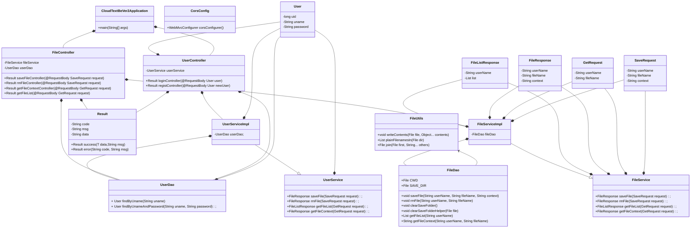

# CloudText 开发文档

---

## 系统需求部分

### 1. 项目可行性分析与描述

本项目的初衷是**构建一个能够实现云端同步的Markdown编辑器**。随着内容平台的大众化，技术的普及化（如微信公众号，知乎等），Markdown如今也已不再是“只属于程序员”的书写语言，其受众人群也在不断扩大。但是当前市场上，虽然存在着大量的Markdown编辑器，其均有些许不尽如人意的地方。比如广受好评的WYSIWYG（所见即所得）式的软件[Typora](https://typora.io/)，能做到极其直观的MD编辑（实际上本文档即是使用该软件编辑），**但是其文件保存仅基于本地**，当有移动编辑，远程办公需求时必须基于其他如OneDrive，坚果云等网盘服务实现。因此，由于书写流程中存在不止一个平台，整个Markdown书写体验势必较为割裂（个人经历中，有多次因为写完忘记上传到云端导致无法在另一台设备上继续编辑）。因此，我们目标就是**结合这两类软件**，开发一款能够实现云端同步的Markdown编辑器，以服务同时**对Markdown编辑**（如自媒体从业人员，程序开发人员等）与**对远程办公，多设备协作**有需求的人群。

基于上述目的，我们在网络上进行了技术选型与问题前期调研。我们在查阅了相关资料后，发现了一个基于纯`JavaScript+CSS`构建的MD编辑器`Vditor`，其也能够实现包括所见即所得的编辑模式，且能迁移到现代化的`Vue`框架上，为了不再重复造轮子，我们于是使用其提供对Markdown的渲染。

在查找相关资料的同时，我们也找到了试图与我们实现相似内容的软件/平台，如坚果云Markdown，但是其在Markdown编辑上仅能实现`sv`模式，即最传统的左编辑右预览模式，而我们的项目可以实现包括`sv`，`ir`，`wysiwyg`三种编辑方式，确保最大化适应用户的编辑习惯。除此外，我们也发现了一些基于`Vditor`的非云同步平台，但其基本上都是使用较旧的框架，如`Vue2`等，长期支持程度一半，而我们的项目将使用当前最新的技术栈，即如`Vite+Vue3+Less+TS`，`Element-Plus`，`SpringBoot`等，相比较于以前的项目于各方面都能得以提升。


### 2. 系统功能


### 3. 领域模型

TODO：前端

后端主要类的UML类图如下



后端部分中，主要分为了`configs, controllers, daos, domain, services, utils`6大包。`configs`包中包含了后端程序所需的所有配置类；`utils`包中包含了一些IO以及信息包装类，方便开发；`domain`包中包含了从前端发送来的json中获取信息以及在后端内部传递信息的数据类；`daos`包承担了数据库/文件系统读写的任务；`service`类中包含了服务层的接口以及实现接口的子包`serviceImpl`,`controllers`包中定义了一些控制器，用于与前端交流。

---

## 系统设计部分

### 1. 系统总体架构

前端：

后端：

后端在完成构建后只有一个`jar`包，在服务器终端直接`java -jar cloudtextBE_ver2.jar`运行即可。

### 2. 系统技术关键点

前端：

后端：

后端主要使用了`spring boot + spring web`的框架，在开发初期拟添加`spring security`组件用于提升整体安全水平，但奈何水平有限，使用的`spring boot3 + spring security6`的组合在网上的资料较少，出现了一些难以解决的疑难杂症，大量查阅国内外相关资料后仍无法找到具体原因。因此无奈选择放弃使用`spring security`组件，仅使用`spring boot + spring web`。后端的主要技术关键点就是spring框架，自底向上设计数据访问层，服务层以及控制器层。其中遇到了不少问题，例如在刚上手开发时，对spring框架的结构不甚了解，导致代码编写时没有条例逻辑，在阅读了几个github上的项目源码后才对整个过程有了一定的了解，才使得接下来的后端开发能顺利进行下去。又例如对http方法以及spring web对这些方法的处理方式不够了解导致后端为一个接口映射了对应`get`方法的控制器，在使用postman测试时没有发现任何问题，但是当前后端联合调试时发现前端发送消息后总会收到状态码400，经过查阅后得知spring web中标注了`@GetMapping(<url>)`的控制器无法从前端发送的json中接收请求体，将`Get`改为`Post`后前后端可以正常通信。在开发过程中这样的小问题不断发生，但是通过不断查阅资料以及询问LLM，最终还是克服了这些问题并完成了后端的编写。

---

## 系统附加说明

### 1. 软件运行开发环境

#### Web端：

软件前端采用`Vite`脚手架，`Vue3`框架开发，采用`Yarn`进行包管理。将项目`clone`到本地后，`front-end`代表前端代码，终端执行：

```bash
cd front-end
yarn
yarn dev
```

即可打开前端网页。

#### 服务端

服务端程序使用`java`语言开发，基于`Oracle OpenJdk 21`，使用`spring boot + spring web`组件，使用`Intellij Idea`开发。将项目`clone`到本地后，使用`Intellij`打开`cloudtextBE_ver2`文件夹，并运行，或者可以选择构建`cloudtextBE_ver2.jar`包，获取到`jar`包后在终端执行：

```
java -jar cloudtextBE_ver2.jar
```

即可运行服务端。

---

## 系统开发记录

### 1. 开发时间表


### 2. 成员分工

李杨：前端开发、测试，前后端联调

马国健：后端开发、测试，前后端联调
